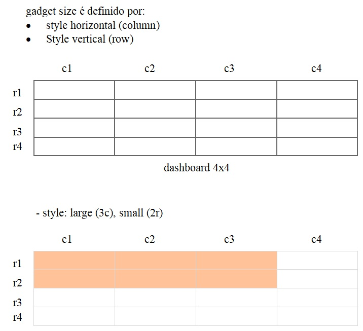

*Projeto*: Suite

*Objetivo*:

Produzir uma lista vertical de gadgets (documento, imagem, vídeo etc.)

arranjados em uma lista horizontal e salvar o resultado em um banco de dados.

A ideia surgiu do site da Microsoft (figura abaixo)

Criar aplicativos (WPF) para gerenciar gadgets e fazer o layout dos mesmos

salvando o resultado em um banco de dados (SQL Server)

O projeto pode ser dividido como: (figura abaixo)

| launcher | gadget                    | layout                                      |
|----------|---------------------------|---------------------------------------------|
| main app | documento                 | bag                                         |
|          | imagem                    | horizontal: shelf, drawer                   |
|          | vídeo etc.                | vertical: chest                             |

*Layout*:

Os gadgets são formatados para uma matriz (dashboard) de 4cx4r dando um total de

16 possíveis layouts (tamanhos). Para identificar o size de uma cell neste
dashboard

usa-se “style”.

| Style               |                |
|---------------------|----------------|
| horizontal (column) | Vertical (row) |
| mini                | mini           |
| small               | small          |
| large               | large          |
| big                 | big            |

*Settings*:

\- tamanho (pixel) da coluna

\- connection string SQL Server

*Ferramentas* (tools):

| IDE                | Language          | Tools                                                                                                   | UI                                            |
|--------------------|-------------------|---------------------------------------------------------------------------------------------------------|-----------------------------------------------|
| Visual Studio 2019 | C\# 7.3           | Caliburn.Micro 3.2 (MVVM pattern)                                                                       | MaterialDesignThemes 2.5                      |
|                    | .Net 4.7.2        | XDMessaging.Lite 5                                                                                      | gong-wpf-dragdrop 1.1                         |
|                    |                   | Microsoft.EntityFrameworkCore.SqlServer 2.2                                                             |                                               |
|                    |                   | rrLibrary                                                                                               |                                               |
