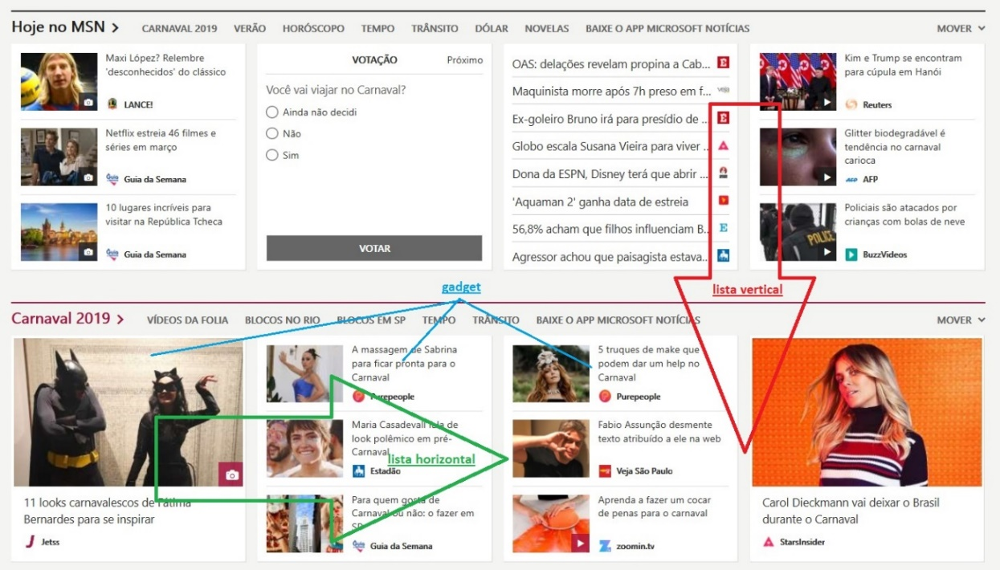

Projeto:
-   Suite

Objetivo:
-   Produzir uma lista vertical de gadgets (documento, imagem, vídeo etc.)
    arranjados em uma lista horizontal e salvar o resultado em um banco de
    dados.  
    A ideia surgiu do site da Microsoft (figura: 1)

Figura 1

-   Criar aplicativos (WPF) para gerenciar os gadgets e fazer o layout dos
    mesmos salvando o resultado em um banco de dados (SQL Server)

-   O projeto pode ser dividido como: (figura 2)  
    - launcher (main app)  
    - gadget (documento, Imagem, video etc.)  
    - layout (bag, layout horizontal: shelf, drawer e layout vertical: chest)  
 
