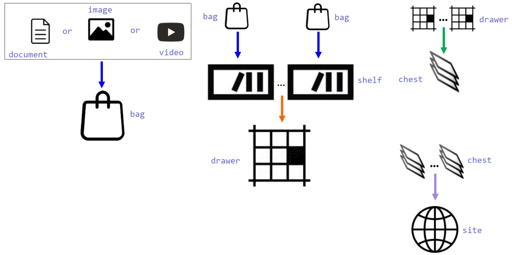

*Projeto*: Suite

*Objetivo*:

Produzir uma lista vertical de gadgets (documento, imagem, vídeo etc.)

arranjados em uma lista horizontal e salvar o resultado em um banco de dados.

A ideia surgiu do site da Microsoft (figura abaixo)

Criar aplicativos (WPF) para gerenciar gadgets e fazer o layout dos mesmos

salvando o resultado em um banco de dados (SQL Server)

O projeto pode ser dividido como: (figura abaixo)

| launcher | gadget     | layout                    |
|----------|------------|---------------------------|
| main app | documento  | bag                       |
|          | imagem     | horizontal: shelf, drawer |
|          | vídeo etc. | vertical: chest           |

*Layout*:

Os gadgets são formatados para uma matriz (dashboard) de 4cx3r dando um total de

12 possíveis layouts (tamanhos). Para identificar uma cell neste dashboard

usa-se “style” e “size”.

\| style \| size \| \| (row) \| (column) \|
\|----------------------------------------------\|--------------\| \| mini (row
x 1) \| 1 \| \| small (row x 2) \| 2 \| \| large (row x 3) \| 3 \| \| \| 4 \|

Por exemplo:

| style: small, size: 2 | C1 | C2 | C3 | C4 |
|-----------------------|----|----|----|----|
| R1                    |    |    |    |    |
| R2                    |    |    |    |    |
| R3                    |    |    |    |    |

*Settings*:

\- tamanho (pixel) da coluna

\- connection string SQL Server

*Ferramentas* (tools):

| IDE                | Language   | Tools                                       | UI                       |
|--------------------|------------|---------------------------------------------|--------------------------|
| Visual Studio 2019 | C\# 7.3    | Caliburn.Micro 3.2 (MVVM pattern)           | MaterialDesignThemes 2.5 |
|                    | .Net 4.7.2 | XDMessaging.Lite 5                          | gong-wpf-dragdrop 1.1    |
|                    |            | Microsoft.EntityFrameworkCore.SqlServer 2.2 |                          |
|                    |            | rrLibrary                                   |                          |
